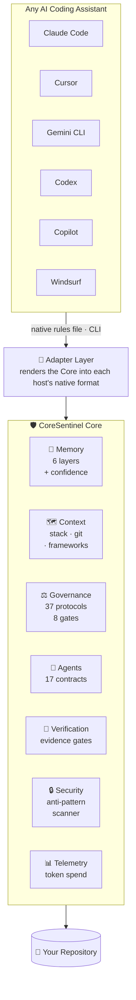
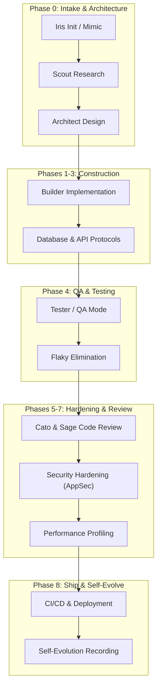

# 🛡️ CoreSentinel

> **The AI engineering governance and context layer.**
> Give any AI coding assistant the memory, rules, and verification it cannot provide itself.

<div align="center">

[](./VERSION)
[](./LICENSE)
[](#-how-does-it-work)
[](#-coresentinel-tests-itself)
[](#-install)

</div>

---

## 💡 What is it?

CoreSentinel is a **file-based governance and context layer that sits underneath your AI coding assistant**.

It is not a prompt, a plugin, or a set of instructions for one tool. It is a vendor-neutral core — persistent memory, enforced rules, agent contracts, and an evidence-based verification engine — that any assistant reads from and is held to. Claude Code, Cursor, Gemini CLI, Codex, Copilot and Windsurf all consume the same core.

---

## 🤔 Why does it exist?

AI coding agents are capable but structurally unreliable in three specific ways. Each one is a governance problem, not a model problem.

| The failure | What it looks like | What CoreSentinel does |
| :--- | :--- | :--- |
| **They forget** | Every session restarts from zero. The agent re-derives your stack, re-asks answered questions, and contradicts last week's architecture decision. | A 6-layer memory with confidence scores, plus a permanent decision ledger recording *why* each choice was made. |
| **They drift** | Different answers to the same question. Rules followed on Monday, ignored on Friday. No consistent standard across projects or tools. | 37 protocols, 8 ordered quality gates, and 17 agent contracts with explicit authority boundaries — identical on every host. |
| **They can't verify themselves** | *"Fixed the vulnerability."* *"All tests pass."* Claims stated with total confidence and zero evidence. | Verification gates that require artifacts — diff, test run, security scan — and score them. Below 80/100 is `UNVERIFIED`, not "done". |

The third one is the reason this project exists. An agent that cannot prove its work is an agent you have to re-check by hand, which erases the leverage it was supposed to give you.

---

## ⚙️ What does it do?

Seven services. Every host consumes the same ones.

| Service | What it holds | Command |
| :--- | :--- | :--- |
| 🧠 **Memory** | 6 layers — working, session, project, long-term, failures, patterns — each fact carrying a confidence score. `≥0.90` is Known, below `0.50` is Unknown, and the agent may not present the second as the first. Facts are searchable, decay until re-verified, and are promoted, merged or compacted as they age. | `coresentinel memory` `recall` `brief` |
| 🗺️ **Context** | The pack an agent needs before touching code: stack, frameworks, test runner, key files, git history, recorded facts. | `coresentinel context` |
| ⚖️ **Governance** | 37 protocols, 8 quality gates (`Plan → … → Deployment`), an architecture decision ledger, and a controlled self-evolution pipeline for rule changes. | `coresentinel gate` |
| 👥 **Agents** | 17 specialist contracts declaring input artifacts, output artifacts, authority level and constraints. A read-only researcher cannot silently write files. | `coresentinel agent` |
| 🧾 **Verification** | Evidence-based gates. A claim requires collected artifacts and scores ≥80/100 to reach `VERIFIED`, plus a static review pass over the working diff. | `coresentinel verify` |
| 🔒 **Security** | Anti-pattern and secret scanner wired into git pre-commit, so unverified or leaking work cannot be committed. | `coresentinel check` |
| 📊 **Telemetry** | Token spend, session analytics and hot files, aggregated across every AI tool you have installed. | `coresentinel stats` |

---

## 🏗️ How does it work?

One core. Adapters project it onto whichever assistant you use — they are projections, never forks.



Adding a host means appending one entry to [`adapters.json`](./adapters.json) — no engine changes. Sync is a dry run by default, generated files carry a `CORESENTINEL:MANAGED` marker, and a hand-authored rules file is **never** silently overwritten.

---

## 🎬 Show me

Binding a real project and reviewing a change — actual output, nothing staged:

```console
$ coresentinel init ~/projects/payments-api

================================================================
  🛡️  CoreSentinel Init — Bind Project to Core
================================================================
  Project        : payments-api
  Stack Detected : Node/TypeScript
  Frameworks     : Express, Prisma
  Test Runner    : npm test (jest)
  ------------------------------------------------------------
  [✓] Wrote .coresentinel/config.json
  [✓] Wrote .coresentinel/context.json (project context pack)
  [✓] Seeded project memory: payments-api stack: Node/TypeScript
  [✓] Seeded project memory: payments-api frameworks: Express, Prisma
  [✓] Seeded project memory: payments-api test runner: npm test (jest)
================================================================
```

The agent now writes some code. Before it claims to be done:

```console
$ coresentinel review

================================================================
  🛡️  CoreSentinel Static Review — Working Diff
================================================================
  Changed Files    : 3 (1 source, 0 test)
  Review Scope     : static pass over added lines only
  ------------------------------------------------------------
  Findings (0 blocking, 2 warning, 0 info):
  ------------------------------------------------------------
  [!] WARN  AP-003   charge.js:2
      └─ console.log left in source
  [!] WARN  AP-002   (diff-wide)
      └─ 1 source file(s) changed with no test file changed
  ------------------------------------------------------------
  Verdict          : APPROVED WITH COMMENTS
================================================================
```

And the system checks itself:

```console
$ coresentinel doctor

================================================================
  🛡️  CoreSentinel Doctor — Subsystem Diagnostics
================================================================
  ────────────────────────────────────────────────────────────

  ✓ Configuration          6 core assets present
  ✓ Memory                 7 layers valid, 4 recorded entries
  ✓ Governance             37 protocols, ledgers consistent
  ✓ Agent Registry         17 contracts complete
  ✓ Verification Engine    validator + 9 engines operational
  ✓ Security Rules         5 rules armed, 4 blocking
  ✓ Project Context        Node/TypeScript on 'main', 6 host(s)

  ────────────────────────────────────────────────────────────
  CoreSentinel: HEALTHY
================================================================
```

Every command exits non-zero on failure and accepts `--json`, so the whole thing drops straight into CI:

```bash
coresentinel doctor --json | jq '.overall'
coresentinel review --json | jq '.findings[] | select(.severity == "BLOCK")'
```

---

## 🚀 Install

```bash
git clone https://github.com/wafazz/CoreSentinel.git
cd CoreSentinel
```

```powershell
.\setup.ps1          # Windows
```
```bash
chmod +x setup.sh && ./setup.sh    # Linux / macOS
```

Then bind your assistant and your project:

```bash
coresentinel adapter detect            # find installed AI hosts
coresentinel adapter sync cursor --apply
coresentinel init                      # bind the current project
coresentinel doctor                    # confirm every subsystem is healthy
```

Requires Python 3.9+. The installer asks for your agent name, role, and squad preferences; pass `-NonInteractive` (PowerShell) or `NON_INTERACTIVE=1` (Bash) for CI.

---

## 🧪 CoreSentinel tests itself

A governance system that is not itself tested is an unverified claim. **436 tests across the 8 subsystems**, plus a gated CI pipeline:

```text
Pull Request ➔ Tests ➔ Security ➔ Lint ➔ Integration ➔ Compatibility ➔ PASS / FAIL
```

```bash
pip install -r requirements-dev.txt
python -m pytest
```

The suite never touches the real `memory/` directory, your home directory, or any host config path — mutating tests run against a sandbox copy of the Core. Compatibility runs everything across 3 operating systems × 3 Python versions. Details in [`30-selftest-protocol.md`](./30-selftest-protocol.md).

---

## 📖 Reference

<details>
<summary><b>⌨️ Full command surface</b></summary>

```text
  Setup & Diagnostics      init · doctor · status
  Context & Memory         context · memory · recall · brief · journal · decision
  Verification & Review    verify · review · gate · check
  Squad & Governance       agent · audit · score · evolve
  Integration & Telemetry  adapter · stats · hooks · version
```

Every command writes its payload to stdout and its diagnostics to stderr, so `--json` output stays parseable even when the Core is damaged. The product version lives in the single `VERSION` file at the Core root — `coresentinel version` reports it along with Python, platform and the loaded registry versions.

`coresentinel help <command>` gives usage for any one of them. Unknown commands exit 1 with a suggestion rather than silently running something else. Full reference: [`14-cli-protocol.md`](./14-cli-protocol.md).

</details>

<details>
<summary><b>🧠 Layered memory & the decision ledger</b></summary>

| Layer | Scope | Purpose |
| :--- | :--- | :--- |
| Working | **project** | Current task state |
| Session | **project** | Active conversation goals |
| Project | **project** | Verified stack & architecture facts |
| Long-term | core | Cross-session repository knowledge |
| Failures | core | Incidents, bugs, anti-pattern history |
| Patterns | core | Reusable engineering patterns |

State about *this* codebase lives with the project in `<project>/.coresentinel/memory/`, resolved by walking up for `.coresentinel/config.json` the way git finds `.git`. Knowledge that transfers between projects stays in the shared Core. Without that split, running `init` across ten repositories would pile ten projects' facts into one global layer.

```bash
coresentinel memory show                 # scope resolved from the current directory
coresentinel memory show ~/code/api      # or from a specific project
coresentinel memory add --layer project --fact "Uses PostgreSQL" --confidence 0.98 --source "docker-compose.yml"

coresentinel decision add \
  --title "Use PostgreSQL instead of MongoDB" \
  --reason "Transactional consistency required for the payment ledger" \
  --chosen "PostgreSQL" --alts "MongoDB, MySQL"
```

Confidence is enforced, not decorative: `≥0.90` Known, `≥0.50` Assumed, below that Unknown.

</details>

<details>
<summary><b>♻️ Memory lifecycle — recall, decay, promotion, journal</b></summary>

A memory store that only ever grows is a memory store that eventually lies. Recording a fact is the easy half; the ecosystem governs what happens to it afterwards.

```bash
coresentinel brief                        # where the work left off — read this first
coresentinel recall "postgres migration"  # one query across layers, decisions and journal
coresentinel journal add --entry "Rewrote the token refresh path" --tags "auth,refactor"
```

`recall` ranks by term coverage, bonuses an exact phrase hit and weights by confidence — scaled to `[0.5, 1.0]`, never to zero, because a low-confidence fact you can see is safer than one you cannot.

Every lifecycle operation is a **dry run until `--apply`**, and every destructive one snapshots first:

| Command | What it does |
| :--- | :--- |
| `memory decay` | Confidence erodes 0.05 per 30 unverified days, floor 0.30. Computed from `base_confidence` and age, so it is idempotent. `failures` and `--pinned` facts are exempt. |
| `memory verify --match "..."` | Restarts the decay clock. Requires a match string — re-verifying everything at once would launder every guess into a fact. |
| `memory promote` | `session → project` at ≥0.90. `project → longterm` needs ≥0.95, 14 days and an explicit `--transferable` mark, so one repo's stack never becomes global truth. |
| `memory consolidate` | Merges duplicates within a layer and across the tier chain. Keeps the **highest** confidence, never an average or a boost — three recordings of a guess make one guess with `occurrences: 3`. |
| `memory compact` | Folds old sub-0.90 facts into a summary keeping the count, date range and a sample. Summarised, not deleted. |
| `memory snapshots` / `restore` | The undo button. Manifests record absolute origins, so project and Core layers both restore correctly. |

Full protocol: [`04-memory-ecosystem-protocol.md`](./04-memory-ecosystem-protocol.md).

</details>

<details>
<summary><b>🧾 Evidence-based verification</b></summary>

Every claim requires artifacts before it is allowed to be called done:

```text
Claim               : Authentication vulnerability fixed
Evidence Collected  :
  [✓] Code Change                   : PASS (Edited src/auth.ts)
  [✓] Security / Unit Test          : PASS (npm test - 14 passed)
  [✓] Security & Anti-Pattern Audit : PASS (sentinel-validator clean)
  [✓] Git Diff Inspection           : PASS (git diff stat verified)

Status              : VERIFIED
Score               : 100/100
```

`coresentinel score` grades the repository across 7 dimensions (Architecture, Security, Testing, Code Quality, Documentation, Reliability, Dependencies): ≥90 `HEALTHY`, 75–89 `WARNING`, <75 `CRITICAL`.

</details>

<details>
<summary><b>🚦 Quality gates & controlled self-evolution</b></summary>

Eight ordered gates, each resolving to `PASS`, `FAIL`, `BLOCKED` or `WAIVED` — and a waiver always records its rationale:

```text
Plan ➔ Architecture ➔ Security ➔ Implementation ➔ Test ➔ Review ➔ Verification ➔ Deployment
```

```bash
coresentinel gate run
coresentinel gate waive --gate Security --reason "Approved exception for sandbox testing"
```

An agent may not rewrite its own governance. Rule changes go through a proposal pipeline requiring evidence, impact analysis and human approval:

```bash
coresentinel evolve propose --target "anti-patterns.json" \
  --change "Add SQL injection scanner rule" \
  --evidence "Incident RUN-#9281 AppSec audit" \
  --impact "Low risk; adds a pre-commit security check"

coresentinel evolve approve EVO-014 --approver "Fakrul"
```

</details>

<details>
<summary><b>👥 The 17-specialist squad</b></summary>

Each specialist has an explicit contract — input artifacts, output artifacts, authority, constraints, verification gate:

| Category | Specialist | Responsibility |
| :--- | :--- | :--- |
| **Lead** | **Iris** | Orchestration, phase gates, self-evolution recording |
| **Fullstack** | **Atlas** | System architecture & structural design |
| | **Kai** | Third-party integrations & webhooks |
| | **Nova** | Core feature implementation |
| | **Rex** | Refactoring & legacy maintenance |
| **Frontend** | **Luna** | TypeScript/React UI & state management |
| | **Vera** | Accessibility & responsive polish |
| **Review** | **Cato** | Logic correctness & edge cases |
| | **Sage** | Maintainability & pattern review |
| **Security** | **Argus** | OWASP AppSec & vulnerability auditing |
| | **Cipher** | Secret protection & encryption |
| | **Aegis** | Infrastructure hardening, headers, CORS |
| **Database** | **Delta** | Schema design & idempotent migrations |
| | **Indra** | Query profiling & N+1 elimination |
| **Testing** | **Echo** | Unit & feature suites |
| | **Probe** | End-to-end & contract testing |
| **Support** | **Scout** | Read-only research |
| | **Ledger** | Token & cost telemetry |

```bash
coresentinel agent list
coresentinel agent show Architect
```

</details>

<details>
<summary><b>🔌 Supported hosts</b></summary>

| Host | Vendor | Global bind target |
| :--- | :--- | :--- |
| 🟢 **Claude Code** | Anthropic | `~/.claude/CLAUDE.md` |
| 🟣 **Cursor IDE** | Anysphere | `~/.cursor/rules/coresentinel.mdc` |
| 🟣 **Gemini CLI** | Google | `~/.gemini/GEMINI.md` |
| 🟢 **OpenAI Codex** | OpenAI | `~/.codex/AGENTS.md` |
| 🔵 **Google Antigravity** | Google | `~/.antigravity/AGENTS.md` |
| ⚫ **GitHub Copilot** | GitHub | `.github/copilot-instructions.md` *(project)* |
| 🟠 **Windsurf** | Codeium | `~/.codeium/windsurf/memories/global_rules.md` |
| ⚪ **Generic agent** | Open standard | `AGENTS.md` *(project)* |

```bash
coresentinel adapter list      # capability matrix per host
coresentinel adapter detect    # what is installed on this machine
coresentinel adapter export --json    # host-agnostic context bundle
```

See [`13-adapter-protocol.md`](./13-adapter-protocol.md).

</details>

<details>
<summary><b>🗺️ SDLC workflow & phase gates</b></summary>



</details>

<details>
<summary><b>💬 Trigger commands</b></summary>

| Trigger | Protocol | Description |
| :--- | :--- | :--- |
| `<Agent> init` | [`05`](./05-init-protocol.md) | Scaffold a new project with phase gates |
| `mimic this` | [`06`](./06-mimic-protocol.md) | Stack migration from an existing codebase |
| `<Agent> test` | [`01`](./01-sentinel-identity.md) | Sentinel QA mode |
| `<Agent> learn` | [`10`](./10-learn-protocol.md) | Auto-learn a new stack into memory |
| `<Agent> migrate` | [`15`](./15-migration-protocol.md) | Idempotent schema migrations |
| `<Agent> api` | [`16`](./16-api-protocol.md) | Webhook idempotency & signatures |
| `<Agent> ai` | [`17`](./17-ai-protocol.md) | Multi-provider failover & prompt defense |
| `<Agent> perf` | [`45`](./45-performance-protocol.md) | N+1 & runtime profiling |
| `<Agent> ci` | [`50`](./50-ci-cd-protocol.md) | Pipeline setup & build guards |
| `<Agent> handoff` | [`52`](./52-handoff-protocol.md) | Client delivery report |
| `<Agent> debug` | [`60`](./60-debug-protocol.md) | Structured 5-step debugging |
| `<Agent> incident` | [`61`](./61-incident-protocol.md) | Emergency containment & post-mortem |

</details>

<details>
<summary><b>📚 Protocol directory (36 documents)</b></summary>

**Core memory & strategy (00–08)**
[`00-identity`](./00-identity.md) · [`01-sentinel-identity`](./01-sentinel-identity.md) · [`02-team`](./02-team-protocol.md) · [`02-quality-gates`](./02-quality-gates-protocol.md) · [`02-squad-contracts`](./02-squad-contracts-protocol.md) · [`03-workflow-guide`](./03-workflow-guide.md) · [`04-layered-memory`](./04-layered-memory-protocol.md) · [`04-session-memory-format`](./04-session-memory-format.md) · [`05-init`](./05-init-protocol.md) · [`06-mimic`](./06-mimic-protocol.md) · [`07-git-workflow`](./07-git-workflow.md) · [`08-decision-ledger`](./08-decision-ledger-protocol.md)

**Build, integration & platform (09–17)**
[`09-audit-trail`](./09-audit-trail-protocol.md) · [`10-learn`](./10-learn-protocol.md) · [`11-pattern-library`](./11-pattern-library.md) · [`12-health-score`](./12-health-score-protocol.md) · [`13-adapter`](./13-adapter-protocol.md) · [`14-cli`](./14-cli-protocol.md) · [`15-migration`](./15-migration-protocol.md) · [`16-api`](./16-api-protocol.md) · [`17-ai`](./17-ai-protocol.md)

**Testing & QA (25–30)**
[`25-test`](./25-test-protocol.md) · [`26-test-data`](./26-test-data-protocol.md) · [`27-test-pattern-library`](./27-test-pattern-library.md) · [`28-flaky`](./28-flaky-protocol.md) · [`29-test-review`](./29-test-review-protocol.md) · [`30-selftest`](./30-selftest-protocol.md)

**Security, performance & ops (35–61)**
[`35-review`](./35-review-protocol.md) · [`40-security`](./40-security-protocol.md) · [`45-performance`](./45-performance-protocol.md) · [`50-ci-cd`](./50-ci-cd-protocol.md) · [`51-deployment`](./51-deployment-protocol.md) · [`52-handoff`](./52-handoff-protocol.md) · [`55-self-evolution`](./55-self-evolution.md) · [`60-debug`](./60-debug-protocol.md) · [`61-incident`](./61-incident-protocol.md)

</details>

---

## 📄 License

MIT — see [`LICENSE`](./LICENSE).
