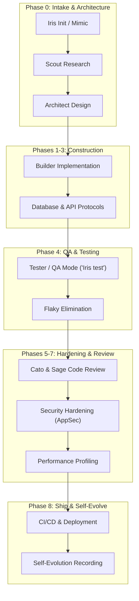

# 🛡️ CoreSentinel

> **Universal AI Agent Governance, Memory Core & Autonomous Squad System**  
> *Transform any AI coding assistant into a disciplined, self-evolving software engineering squad.*

<div align="center">

[](./LICENSE)
[](#-supported-ai-tools)
[](#-the-17-specialist-squad)
[](#-interactive-protocol-directory)

[🚀 Quick Start](#-quick-start) • [⚡ Interactive Commands](#-interactive-command-console) • [🗺️ SDLC Workflow](#-sdlc-workflow--phase-gates) • [👥 17-Specialist Squad](#-the-17-specialist-squad) • [📊 Telemetry](#-token-usage-telemetry)

</div>

---

## 💡 What is CoreSentinel?

**CoreSentinel** is an open-source, file-based AI engineering governance and context layer for coding assistants. It provides persistent memory, structured software development lifecycles (SDLC), specialized multi-agent roles, mandatory squad reviews, strict security hardening, **Evidence-Based Verification Gates**, continuous self-evolution, and cross-project token telemetry—giving AI agents the context, structure, and operational discipline needed for reliable software development.

---

## 🧾 Evidence-Based Verification Gates

Rather than relying on unverified claims, CoreSentinel enforces **Evidence-Based Verification Gates**. Every major claim made by an AI agent (e.g., *"Vulnerability fixed"* or *"Feature implemented"*) requires 5 mandatory evidence artifacts before status is set to `VERIFIED`:

```text
Claim               : Authentication vulnerability fixed
Required Evidence   : Code Change | Security Test | Audit Log | Git Diff

Evidence Collected  :
  [✓] Code Change                   : PASS (Edited src/auth.ts)
  [✓] Security / Unit Test          : PASS (npm test - 14 passed)
  [✓] Security & Anti-Pattern Audit : PASS (sentinel-validator clean)
  [✓] Git Diff Inspection           : PASS (git diff stat verified)

Status              : VERIFIED
Score               : 100/100
```

---

## 🧠 Layered Memory Engine & Confidence Matrix

CoreSentinel replaces unstructured memory logs with a **6-Layer Memory Architecture** backed by confidence scoring (`Known` vs `Assumed` vs `Unknown`):

| Memory Layer | Storage Path | Purpose |
| :--- | :--- | :--- |
| **1. Working Memory** | `memory/working.json` | Current active task state & immediate context |
| **2. Session Memory** | `memory/session.json` | Active conversation history & session goals |
| **3. Project Memory** | `memory/project.json` | Verified architecture, tech stack & framework facts |
| **4. Long-Term Memory**| `memory/longterm.json` | Historical repository context & cross-session knowledge |
| **5. Failure Memory** | `memory/failures.json` | Incident history, bugs, & anti-pattern logs |
| **6. Pattern Memory** | `memory/patterns.json` | Reusable engineering & code patterns |

```bash
# View Layered Memory Matrix & Confidence Scores
coresentinel memory show

# Register a verified fact (Confidence >= 0.90 = Known)
coresentinel memory add --layer project --fact "Project uses PostgreSQL" --confidence 0.98 --source "docker-compose.yml"
```

---

## 📜 Architecture Decision Ledger (ADR)

AI agents repeatedly make architectural decisions. CoreSentinel records them permanently into an **Architecture Decision Ledger**:

```bash
# View all recorded architecture decisions
coresentinel decision list

# Record an Architectural Decision Record (ADR)
coresentinel decision add \
  --title "Use PostgreSQL instead of MongoDB" \
  --reason "Transactional consistency required for payment ledger" \
  --chosen "PostgreSQL" \
  --alts "MongoDB, MySQL"
```

---

## 🗺️ SDLC Workflow & Phase Gates



---

## ⚡ Interactive Command Console

<details open>
<summary><b>🔥 Click to view available trigger commands</b></summary>

| Trigger Command | Target Protocol | Description |
| :--- | :--- | :--- |
| `show stats` | [`agent-stats.py`](./agent-stats.py) | View token usage & session analytics across all detected AI tools |
| `<AgentName> init` | [`05-init-protocol.md`](./05-init-protocol.md) | Scaffolds a new project with SDLC phase gates & architecture templates |
| `mimic this` | [`06-mimic-protocol.md`](./06-mimic-protocol.md) | Activates MIMIC stack migration from an existing codebase |
| `<AgentName> test` | [`01-sentinel-identity.md`](./01-sentinel-identity.md) | Activates Sentinel QA Mode for unit, integration, and E2E test isolation |
| `<AgentName> learn` | [`10-learn-protocol.md`](./10-learn-protocol.md) | Auto-learns new tech stacks & records patterns into memory |
| `<AgentName> migrate` | [`15-migration-protocol.md`](./15-migration-protocol.md) | Idempotent database schema alterations & SQL migration guard |
| `<AgentName> api` | [`16-api-protocol.md`](./16-api-protocol.md) | Webhook idempotency, signatures & backoff handlers |
| `<AgentName> ai` | [`17-ai-protocol.md`](./17-ai-protocol.md) | Multi-provider failover, token metering & prompt defense |
| `<AgentName> perf` | [`45-performance-protocol.md`](./45-performance-protocol.md) | N+1 query profiling & runtime memory optimization |
| `<AgentName> ci` | [`50-ci-cd-protocol.md`](./50-ci-cd-protocol.md) | Pipeline setup, test environment isolation & build guards |
| `<AgentName> handoff` | [`52-handoff-protocol.md`](./52-handoff-protocol.md) | Client delivery protocol & handoff report generation |
| `<AgentName> debug` | [`60-debug-protocol.md`](./60-debug-protocol.md) | Structured 5-step debugging & hypothesis verification |
| `<AgentName> incident` | [`61-incident-protocol.md`](./61-incident-protocol.md) | Emergency incident response, containment & post-mortem |

</details>

---

## 🚀 Quick Start & Interactive Setup

CoreSentinel includes an **interactive installer** that configures your agent name, role, sub-agent squad preferences, and automatically binds rules to all local AI tools.

### 1. Clone CoreSentinel
```bash
git clone https://github.com/wafazz/CoreSentinel.git
cd CoreSentinel
```

### 2. Run Interactive Installer

#### On Windows (PowerShell):
```powershell
.\setup.ps1
```

#### On Linux / macOS (POSIX Shell):
```bash
chmod +x setup.sh
./setup.sh
```

<details>
<summary><b>⚙️ View Interactive Setup Questions Asked During Installation</b></summary>

When you run `setup.ps1` or `setup.sh`, the installer interactively prompts you for:

```text
1) Agent Name? [Default: Iris]
2) Agent acts as what? [Default: Universal coding agent for Fakrul]
3) Create sub-agents or not? (Y/N) [Default: Y]
4) How many sub-agents? [Default: 17]
5) Sub-agents auto-named or give name?
   [1] Auto-named (Standard 17 Squad names: Scout, Architect, Builder, Tester, etc.)
   [2] Give custom names manually
```

*(Note: For non-interactive automation or CI runs, pass `-NonInteractive` on PowerShell or `NON_INTERACTIVE=1` on Bash).*

</details>

---

## 📚 Interactive Protocol Directory

<details>
<summary><b>📂 Core Memory & Strategy Protocols (00 – 07)</b></summary>

- 📄 [`00-identity.md`](./00-identity.md) — Central Memory Core & Agent Identity Index
- 📄 [`01-sentinel-identity.md`](./01-sentinel-identity.md) — QA Automation Mode (`<AgentName> test`)
- 📄 [`02-team-protocol.md`](./02-team-protocol.md) — 17-Specialist Squad Orchestration & Phase Gates 0–8
- 📄 [`03-workflow-guide.md`](./03-workflow-guide.md) — Workflow Guide & Session Token Budgeting
- 📄 [`04-session-memory-format.md`](./04-session-memory-format.md) — Session Memory Template & Auto-Reset Rules
- 📄 [`05-init-protocol.md`](./05-init-protocol.md) — Project Scaffolding & Context Gathering (`<AgentName> init`)
- 📄 [`06-mimic-protocol.md`](./06-mimic-protocol.md) — Stack Migration Protocol (`mimic this`)
- 📄 [`07-git-workflow.md`](./07-git-workflow.md) — Git Branching, Commit Standards & PR Conventions

</details>

<details>
<summary><b>🏗️ Build, Migration & Integration Protocols (10 – 17)</b></summary>

- 📄 [`10-learn-protocol.md`](./10-learn-protocol.md) — Auto-Learn New Tech Stacks (`<AgentName> learn`)
- 📄 [`11-pattern-library.md`](./11-pattern-library.md) — Reusable Architecture & Component Patterns
- 📄 [`15-migration-protocol.md`](./15-migration-protocol.md) — Idempotent Schema & SQL Migrations (`<AgentName> migrate`)
- 📄 [`16-api-protocol.md`](./16-api-protocol.md) — Webhooks, Idempotency & Signature Guard (`<AgentName> api`)
- 📄 [`17-ai-protocol.md`](./17-ai-protocol.md) — AI Multi-Provider Failover & Prompt Defense (`<AgentName> ai`)

</details>

<details>
<summary><b>🧪 Testing & QA Protocols (25 – 29)</b></summary>

- 📄 [`25-test-protocol.md`](./25-test-protocol.md) — Test Strategy & Speed Budgeting
- 📄 [`26-test-data-protocol.md`](./26-test-data-protocol.md) — Test Data, Factories & Isolation Rules
- 📄 [`27-test-pattern-library.md`](./27-test-pattern-library.md) — Proven Test Automation Patterns
- 📄 [`28-flaky-protocol.md`](./28-flaky-protocol.md) — Flaky Test Root Cause & Isolation
- 📄 [`29-test-review-protocol.md`](./29-test-review-protocol.md) — Test Suite Quality & Review Checklist

</details>

<details>
<summary><b>🔒 Security, Performance & Ops Protocols (35 – 61)</b></summary>

- 📄 [`35-review-protocol.md`](./35-review-protocol.md) — Code Review Checklist (Cato + Sage)
- 📄 [`40-security-protocol.md`](./40-security-protocol.md) — Secret Protection, AppSec & Hardening
- 📄 [`45-performance-protocol.md`](./45-performance-protocol.md) — Query Profiling & N+1 Optimization (`<AgentName> perf`)
- 📄 [`50-ci-cd-protocol.md`](./50-ci-cd-protocol.md) — CI/CD Pipeline Protocol (`<AgentName> ci`)
- 📄 [`51-deployment-protocol.md`](./51-deployment-protocol.md) — Deployment Recipes & Troubleshooting
- 📄 [`52-handoff-protocol.md`](./52-handoff-protocol.md) — Client Delivery & Handoff (`<AgentName> handoff`)
- 📄 [`55-self-evolution.md`](./55-self-evolution.md) — Self-Evolution, Skills & Anti-Patterns Log
- 📄 [`60-debug-protocol.md`](./60-debug-protocol.md) — Structured Debugging (`<AgentName> debug`)
- 📄 [`61-incident-protocol.md`](./61-incident-protocol.md) — Emergency Containment & Post-Mortem (`<AgentName> incident`)

</details>

---

## 👥 The 17-Specialist Squad

<details open>
<summary><b>Click to expand squad breakdown</b></summary>

| Category | Specialist | Key Responsibilities |
| :--- | :--- | :--- |
| **Lead** | **Iris / Lead Agent** | Squad orchestration, phase gate enforcement, self-evolution recording |
| **Fullstack** | **Atlas** | System architecture & structural design |
| | **Kai** | Third-party integrations & webhooks |
| | **Nova** | Core feature implementation |
| | **Rex** | Refactoring & legacy maintenance |
| **Frontend** | **Luna** | TS/React UI implementation & state management |
| | **Vera** | Keyboard & screen-reader accessibility (A11y) |
| **Review** | **Cato** | Code logic correctness & edge-case review |
| | **Sage** | Structural maintainability & pattern review |
| **Security** | **Argus** | OWASP AppSec & vulnerability auditing |
| | **Cipher** | Secret protection & encryption handling |
| | **Aegis** | Infrastructure hardening, headers & CORS safety |
| **Database** | **Delta** | Schema normalization & idempotent migrations |
| | **Indra** | Query profiling & N+1 optimization |
| **Testing** | **Echo** | Unit & feature test suite authoring |
| | **Probe** | End-to-end integration & contract testing |
| **Support** | **Scout** | Read-only codebase & doc researcher |
| | **Ledger** | Token telemetry & cloud expenditure tracking |

</details>

---

## 🤖 Supported AI Tools

CoreSentinel automatically binds rules across all major AI coding platforms:

- 🟢 **Claude Code** (`~/.claude/CLAUDE.md`)
- 🔵 **Google Antigravity** (`~/.antigravity/AGENTS.md`)
- 🟣 **Gemini CLI** (`~/.gemini/GEMINI.md`)
- 🟢 **OpenAI Codex** (`~/.codex/AGENTS.md`)
- 🟣 **Cursor IDE** (`~/.cursor/rules/coresentinel.mdc`)

---

## 📊 Token Usage Telemetry

Track token spend and usage statistics across all installed AI tools:

```bash
python agent-stats.py
```

Outputs formatted analytics detailing input/output token counts, tool breakdowns, session durations, and hot files edited.

---

## 📄 License

Distributed under the **MIT License**. See [`LICENSE`](./LICENSE) for details.
