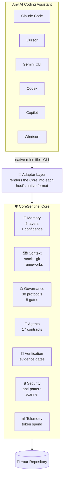
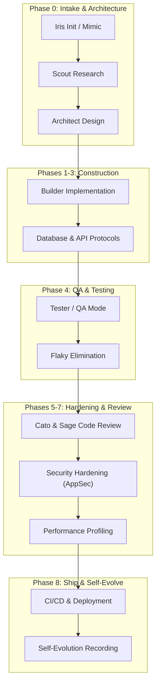

# 🛡️ CoreSentinel

> **The AI engineering governance and context layer.**
> Give any AI coding assistant the memory, rules, and verification it cannot provide itself.

<div align="center">

[](./VERSION)
[](./LICENSE)
[](#-how-does-it-work)
[](#-coresentinel-tests-itself)
[](https://github.com/wafazz/CoreSentinel-Dashboard-Monitoring)
[](#-install)

</div>

---

## 💡 What is it?

CoreSentinel is a **file-based governance and context layer that sits underneath your AI coding assistant**.

It is not a prompt, a plugin, or a set of instructions for one tool. It is a vendor-neutral core — persistent memory, enforced rules, agent contracts, and an evidence-based verification engine — that any assistant reads from and is held to. Claude Code, Cursor, Gemini CLI, Codex, Copilot and Windsurf all consume the same core.

---

## 🤔 Why does it exist?

AI coding agents are capable but structurally unreliable in three specific ways. Each one is a governance problem, not a model problem.

| The failure | What it looks like | What CoreSentinel does |
| :--- | :--- | :--- |
| **They forget** | Every session restarts from zero. The agent re-derives your stack, re-asks answered questions, and contradicts last week's architecture decision. | A 6-layer memory with confidence scores, plus a permanent decision ledger recording *why* each choice was made. |
| **They drift** | Different answers to the same question. Rules followed on Monday, ignored on Friday. No consistent standard across projects or tools. | 38 protocols, 8 ordered quality gates, and 17 agent contracts with explicit authority boundaries — identical on every host. |
| **They can't verify themselves** | *"Fixed the vulnerability."* *"All tests pass."* Claims stated with total confidence and zero evidence. | Checks that actually run — test suite, security scan, linter, dependency audit — each recording its command, exit code and output digest. A check that could not run reports `UNKNOWN` and is never counted as a pass. |

The third one is the reason this project exists. An agent that cannot prove its work is an agent you have to re-check by hand, which erases the leverage it was supposed to give you.

---

## ⚙️ What does it do?

Seven services. Every host consumes the same ones.

| Service | What it holds | Command |
| :--- | :--- | :--- |
| 🧠 **Memory** | 6 layers — working, session, project, long-term, failures, patterns — each fact carrying a confidence score. `≥0.90` is Known, below `0.50` is Unknown, and the agent may not present the second as the first. Facts are searchable, decay until re-verified, and are promoted, merged or compacted as they age. | `coresentinel memory` `recall` `brief` |
| 🗺️ **Context** | Not the whole store — what *this task* needs. Facts, decisions, failures and patterns ranked by relevance, the governance rules that apply, and any decision the task would contradict, all inside a token budget. | `coresentinel context --task "..."` |
| ⚖️ **Governance** | 38 protocols, 10 ordered quality gates (`Requirement → … → Deployment`) each carrying a machine-readable reason code, an architecture decision ledger, and a controlled self-evolution pipeline. | `coresentinel gate` |
| 👥 **Agents** | 17 specialist contracts declaring inputs, outputs, authority — and an **enforced** permission set. An agent is handed a sandbox, never the filesystem: an ungranted write fails at the point of use and the denial is audited. | `coresentinel agent` `task` |
| 🧾 **Verification** | Six checks that execute. Each records its command, exit code, duration and output digest, and resolves to `PASS`, `FAIL` or `UNKNOWN`. `UNKNOWN` leaves the denominator instead of inflating the score, and at least half the evidence budget must run before any verdict. | `coresentinel verify` |
| 🔒 **Security** | Anti-pattern and secret scanner wired into git pre-commit, so unverified or leaking work cannot be committed. | `coresentinel check` |
| 📊 **Telemetry** | Token spend, session analytics and hot files, aggregated across every AI tool you have installed. | `coresentinel stats` |
| 📈 **Its own performance** | Eleven measured subjects and eight published budgets, asserted in CI. A subject nothing exercised reports as never observed, never as zero. | `coresentinel metrics` |

---

## 🏗️ How does it work?

One core. Adapters project it onto whichever assistant you use — they are projections, never forks.



Adding a host means appending one entry to [`adapters.json`](./adapters.json) — no engine changes. Sync is a dry run by default, generated files carry a `CORESENTINEL:MANAGED` marker, and a hand-authored rules file is **never** silently overwritten.

---

## 🎬 Show me

Binding a real project and reviewing a change — actual output, nothing staged:

```console
$ coresentinel init ~/projects/payments-api

================================================================
  🛡️  CoreSentinel Init — Bind Project to Core
================================================================
  Project        : payments-api
  Stack Detected : Node/TypeScript
  Frameworks     : Express, Prisma
  Test Runner    : npm test (jest)
  ------------------------------------------------------------
  [✓] Wrote .coresentinel/config.json
  [✓] Wrote .coresentinel/context.json (project context pack)
  [✓] Seeded project memory: payments-api stack: Node/TypeScript
  [✓] Seeded project memory: payments-api frameworks: Express, Prisma
  [✓] Seeded project memory: payments-api test runner: npm test (jest)
================================================================
```

The agent now writes some code. Before it claims to be done:

```console
$ coresentinel review

================================================================
  🛡️  CoreSentinel Static Review — Working Diff
================================================================
  Changed Files    : 3 (1 source, 0 test)
  Review Scope     : static pass over added lines only
  ------------------------------------------------------------
  Findings (0 blocking, 2 warning, 0 info):
  ------------------------------------------------------------
  [!] WARN  AP-003   charge.js:2
      └─ console.log left in source
  [!] WARN  AP-002   (diff-wide)
      └─ 1 source file(s) changed with no test file changed
  ------------------------------------------------------------
  Verdict          : APPROVED WITH COMMENTS
================================================================
```

And the system checks itself:

```console
$ coresentinel doctor

================================================================
  🛡️  CoreSentinel Doctor — Subsystem Diagnostics
================================================================
  ────────────────────────────────────────────────────────────

  ✓ Configuration          6 core assets present
  ✓ Runtime                bootstrap 1 ms, 4 services
  ✓ Storage                json backend, 12 record(s)
  ✓ Memory                 7 layers valid, 4 recorded entries
  ✓ Governance             38 protocols, ledgers consistent
  ✓ Agent Registry         17 contracts complete
  ✓ Verification Engine    validator + 11 engines operational
  ✓ Security Rules         5 rules armed, 4 blocking
  ✓ Project Context        Node/TypeScript on 'main', 6 host(s)

  ────────────────────────────────────────────────────────────
  CoreSentinel: HEALTHY
================================================================
```

Every command exits non-zero on failure and accepts `--json`, so the whole thing drops straight into CI:

```bash
coresentinel doctor --json | jq '.overall'
coresentinel review --json | jq '.findings[] | select(.severity == "BLOCK")'
```

---

## 🚀 Install

```bash
git clone https://github.com/wafazz/CoreSentinel.git
cd CoreSentinel
```

```powershell
.\setup.ps1          # Windows
```
```bash
chmod +x setup.sh && ./setup.sh    # Linux / macOS
```

Then bind your assistant and your project:

```bash
coresentinel adapter detect            # find installed AI hosts
coresentinel adapter sync cursor --apply
coresentinel init                      # bind the current project
coresentinel doctor                    # confirm every subsystem is healthy
```

Requires Python 3.9+. The installer asks for your agent name, role, and squad preferences; pass `-NonInteractive` (PowerShell) or `NON_INTERACTIVE=1` (Bash) for CI.

---

## 🧪 CoreSentinel tests itself

A governance system that is not itself tested is an unverified claim. **1,355 tests across the 14 subsystems**, plus a gated CI pipeline:

```text
Pull Request ➔ Tests ➔ Security ➔ Performance ➔ Lint ➔ Integration ➔ Compatibility ➔ PASS / FAIL
```

```bash
pip install -r requirements-dev.txt
python -m pytest
```

The suite never touches the real `memory/` directory, your home directory, or any host config path — mutating tests run against a sandbox copy of the Core. Compatibility runs everything across 3 operating systems × 3 Python versions. Details in [`30-selftest-protocol.md`](./30-selftest-protocol.md).

---

## 📖 Reference

<details>
<summary><b>⌨️ Full command surface</b></summary>

```text
  Setup & Diagnostics      init · doctor · status · config · migrate
  Context & Memory         context · project · knowledge · memory · recall · brief · journal · decision
  Verification & Review    verify · review · gate · check
  Squad & Governance       agent · task · audit · incident · pattern · score · evolve
  Integration & Telemetry  serve · mcp · adapter · metrics · stats · hooks · version
```

Every command writes its payload to stdout and its diagnostics to stderr, so `--json` output stays parseable even when the Core is damaged. The product version lives in the single `VERSION` file at the Core root — `coresentinel version` reports it along with Python, platform and the loaded registry versions.

`coresentinel help <command>` gives usage for any one of them. Unknown commands exit 1 with a suggestion rather than silently running something else. Full reference: [`14-cli-protocol.md`](./14-cli-protocol.md).

</details>

<details>
<summary><b>🧠 The project brain — every value names the file that proves it</b></summary>

```console
$ coresentinel project inspect --verbose

  Languages         : PHP
      └─ PHP: composer.json (manifest present)
  Frameworks        : Laravel
      └─ Laravel: composer.json (require['laravel/framework']) — ^11.0
  Datastores        : PostgreSQL, Redis
      └─ PostgreSQL: docker-compose.yml (service image 'postgres:16')
      └─ Redis: docker-compose.yml (service image 'redis:7')
  Package Managers  : composer
      └─ composer: composer.lock (lockfile present)
  Ci                : GitHub Actions
      └─ GitHub Actions: .github/workflows (configuration present) — 1 workflow(s): ci.yml
  Api               : Laravel API routes, 1 controller file(s)
```

Ten dimensions, and a dimension nothing evidenced reports **`unknown`** — which is not the same as empty. One means there is no database; the other means we could not tell, and only one of those is safe to act on.

Frameworks are matched on the exact package that means the framework is in use, never a substring. `symfony/framework-bundle` means Symfony; `symfony/console` does not — **and Laravel depends on it**, so substring matching made every Laravel project claim Symfony. Likewise `next-auth` is not Next.js and `@types/react` is not React.

`.env` files are read for **key names only**. The values are the secrets this product exists to protect.

</details>

<details>
<summary><b>🕸️ Knowledge graph — how the pieces connect</b></summary>

```console
$ coresentinel knowledge query ADR-042 --depth 2

  decision:ADR-042
     --concerns--> file:src/Session.php          ADR-042.related_files
     --caused_by--> incident:INC-1024            ADR-042.related_incidents
     --governs--> project:payments-api           project ledger
    project:payments-api
       --uses--> datastore:PostgreSQL            docker-compose.yml (service image 'postgres:16')
```

Every edge comes from something that was **recorded** — a discovery finding and its evidence, a decision's related files, a supersession. Nothing is inferred from source code: a graph that guesses "this controller probably implements that feature" answers confidently and wrongly.

No graph database. The relationships number in the hundreds and are already stored; the graph is rebuilt on every query in tens of milliseconds, so a superseded decision can never linger in an answer.

</details>

<details>
<summary><b>🎯 Task-relevant context — what the agent needs, not everything you know</b></summary>

Dumping the whole memory store into a prompt is the failure this project exists to remove, so `context` takes a task and a budget:

```bash
coresentinel context --task "Add Redis caching to product listing" --budget 4000
```

```text
## Project
  - Stack: Node/TypeScript      - Frameworks: Express      - Test runner: npm test (jest)

## Governance rules that apply
  - [AP-004] No raw API keys/tokens in source code. All tenant data queries must be scoped.

## Decisions already made
  - [ADR-042] Use Redis for session storage → Redis
      MySQL connection saturation observed under production load

## Known failures — do not repeat
  - Redis eviction wiped the session store under memory pressure   confidence 0.99, INC-1024

## Reusable patterns
  - Cache-aside with an explicit TTL for Redis reads

----------------------------------------------------------------
  ~310 of 4000 budgeted tokens (characters / 4 — an approximation, not a tokenizer measurement)
```

The payroll export, the PDF renderer and every other unrelated fact stay out. Ranking is the same engine `recall` uses; the anti-pattern rules are matched on the `trigger_context` they already declare; and if the pack does not fit, the count and the best excluded item are printed — **a partial pack never reads as a complete one**.

Without `--task`, `context` behaves exactly as before.

</details>

<details>
<summary><b>📜 Decision intelligence — an agent cannot quietly reverse an architecture decision</b></summary>

```console
$ coresentinel decision verify --change "I recommend switching from Redis to database sessions"

  [✗] CONTRADICTS  ADR-042: Use Redis for session storage
      proposes moving away from Redis, which ADR-042 selected
      Reason recorded : MySQL connection saturation observed under production load
      Evidence        : INC-1024 production incident
  ----------------------------------------------------------------
  Verdict   : REVIEW REQUIRED
```

Exit `1`, so it drops into a pre-commit hook or a CI step. The reason it cites was written the day the decision was made — the saturation happened in production months ago and nothing in the code says so.

Reversing a decision is allowed. Reversing it invisibly is not:

```bash
coresentinel decision add --title "..." --reason "..." --chosen "PostgreSQL"
coresentinel decision supersede ADR-042 --by ADR-051 --reason "Load profile changed"
```

Ordinary related work is **not** blocked — *"Add Redis caching to the product listing"* returns `TOUCHES`, informational, exit `0`. A check that blocks normal work is a check people route around.

Decisions are scoped like memory: the bound project's ledger lives in `<project>/.coresentinel/memory/decisions.json`. Ids are allocated across both scopes, so `ADR-004` never means two different things.

</details>

<details>
<summary><b>🧠 Layered memory & the decision ledger</b></summary>

| Layer | Scope | Purpose |
| :--- | :--- | :--- |
| Working | **project** | Current task state |
| Session | **project** | Active conversation goals |
| Project | **project** | Verified stack & architecture facts |
| Long-term | core | Cross-session repository knowledge |
| Failures | core | Incidents, bugs, anti-pattern history |
| Patterns | core | Reusable engineering patterns |

State about *this* codebase lives with the project in `<project>/.coresentinel/memory/`, resolved by walking up for `.coresentinel/config.json` the way git finds `.git`. Knowledge that transfers between projects stays in the shared Core. Without that split, running `init` across ten repositories would pile ten projects' facts into one global layer.

```bash
coresentinel memory show                 # scope resolved from the current directory
coresentinel memory show ~/code/api      # or from a specific project
coresentinel memory add --layer project --fact "Uses PostgreSQL" --confidence 0.98 --source "docker-compose.yml"

coresentinel decision add \
  --title "Use PostgreSQL instead of MongoDB" \
  --reason "Transactional consistency required for the payment ledger" \
  --chosen "PostgreSQL" --alts "MongoDB, MySQL"
```

Confidence is enforced, not decorative: `≥0.90` Known, `≥0.50` Assumed, below that Unknown.

</details>

<details>
<summary><b>♻️ Memory lifecycle — recall, decay, promotion, journal</b></summary>

A memory store that only ever grows is a memory store that eventually lies. Recording a fact is the easy half; the ecosystem governs what happens to it afterwards.

```bash
coresentinel brief                        # where the work left off — read this first
coresentinel recall "postgres migration"  # one query across layers, decisions and journal
coresentinel journal add --entry "Rewrote the token refresh path" --tags "auth,refactor"
```

`recall` ranks by term coverage, bonuses an exact phrase hit and weights by confidence — scaled to `[0.5, 1.0]`, never to zero, because a low-confidence fact you can see is safer than one you cannot.

Every lifecycle operation is a **dry run until `--apply`**, and every destructive one snapshots first:

| Command | What it does |
| :--- | :--- |
| `memory decay` | Confidence erodes 0.05 per 30 unverified days, floor 0.30. Computed from `base_confidence` and age, so it is idempotent. `failures` and `--pinned` facts are exempt. |
| `memory verify --match "..."` | Restarts the decay clock. Requires a match string — re-verifying everything at once would launder every guess into a fact. |
| `memory promote` | `session → project` at ≥0.90. `project → longterm` needs ≥0.95, 14 days and an explicit `--transferable` mark, so one repo's stack never becomes global truth. |
| `memory consolidate` | Merges duplicates within a layer and across the tier chain. Keeps the **highest** confidence, never an average or a boost — three recordings of a guess make one guess with `occurrences: 3`. |
| `memory compact` | Folds old sub-0.90 facts into a summary keeping the count, date range and a sample. Summarised, not deleted. |
| `memory snapshots` / `restore` | The undo button. Manifests record absolute origins, so project and Core layers both restore correctly. |

Full protocol: [`04-memory-ecosystem-protocol.md`](./04-memory-ecosystem-protocol.md).

</details>

<details>
<summary><b>🧾 Evidence-based verification</b></summary>

Every claim requires a command that ran. Each check records what it executed, what it exited with, and a digest of what it said:

```text
Claim               : Authentication vulnerability fixed

  [✓] Code Change                    PASS      20/20 pts
      └─ 3 file(s) changed: src/auth.ts, src/session.ts, auth.test.ts
         $ git status --porcelain  → exit 0  (31 ms, sha256:1b375a38128d)
  [✓] Security / Unit Test           PASS      25/25 pts
      └─ test suite exited 0 in 4210 ms
         $ npm test  → exit 0  (4210 ms, sha256:9f0ab2c41d77)
  [✗] Security & Anti-Pattern Audit  FAIL       0/20 pts
      └─ scanner reported violations (exit 1)
  [?] Dependency Vulnerability Audit UNKNOWN     n/a pts
      └─ no dependency audit tool is available for this stack on this machine

Executed          : 2 pass, 1 fail, 3 unknown
Evidence Coverage : 65/100 weight (minimum 50)
Status : UNVERIFIED
Score  : 69/100
```

**`UNKNOWN` is the state that matters.** It means nothing could be run — no test runner installed, no linter configured, not a git repository. It is excluded from the denominator rather than counted as a pass, and at least **50 of the 100 evidence points must execute** before any verdict is issued at all. A directory that cannot evidence anything returns `INDETERMINATE` and exit code `2`, not a passing score.

```bash
coresentinel verify --json | jq '.checks[] | select(.status == "UNKNOWN")'
```

`coresentinel score` grades the repository across 7 dimensions. Every dimension is the fraction of its named signals that are met, and every signal states its basis — the command that produced it or the filesystem measurement it read:

```bash
coresentinel score --explain
```

```text
  Testing            : 100/100  [████████████████████]  (2 of 3 signals)
      [·] Test suite passes
          basis: /usr/bin/python3 -c 'import pytest' — pytest is configured but not installed
      [✓] Test files present
          basis: 31 source file(s) scanned — 15 test file(s)
      [✓] Test-to-source ratio >= 0.2
          basis: 15 test / 16 production file(s) — ratio 0.94
```

A dimension whose signals cannot be evaluated reports `UNKNOWN` and stays out of the mean; fewer than three evaluable dimensions yields `INDETERMINATE`. Otherwise ≥90 `HEALTHY`, 75–89 `WARNING`, <75 `CRITICAL`.

</details>

<details>
<summary><b>🧬 Controlled evolution — the loop, and the controls on it</b></summary>

```text
incident → root cause → pattern → candidate → evidence
        → human approval → versioned rule → future agents
```

Until v10.9 the pipeline stopped one step short and said otherwise: `evolve approve` set a status and printed *"Versioned Change Released"* while writing no rule file at all. The next agent read exactly the rules it read before.

**Observation is not a lesson, and a lesson is not a rule.**

```console
$ coresentinel evolve observe

  [▶] CAND-8efb2da38b  CORROBORATED  2 source(s)
      Flag repeated relationship queries inside a loop during review
  ----------------------------------------------------------------
  1 ready to propose (needs 2 distinct sources).
```

A candidate needs **two distinct sources** before it may be proposed — one incident is an anecdote. The same source cannot corroborate itself, re-running the observer never inflates evidence, and a **rejected candidate stays rejected**: a review queue that re-asks a declined question every run is a queue people stop reading.

Then the part that was missing entirely:

```console
$ coresentinel evolve apply EVO-004
[!] EVO-004 is PENDING_REVIEW, not APPROVED — an evolution is applied by a
    human decision, never by reaching the end of a pipeline

$ coresentinel evolve approve EVO-004 --approver "Fakrul"
[✓] APPROVED by Fakrul.  Nothing has changed yet. Apply it with:
      coresentinel evolve apply EVO-004

$ coresentinel evolve apply EVO-004
[✓] EVO-004 applied to anti-patterns.json
    Change   : AP-006 · WARNING · registry v1.0.0 → v1.1.0
    Snapshot : EVO-004-20260814-025437-anti-patterns.json
    Reverse it any time: coresentinel evolve revert EVO-004
```

A newly learned rule **warns before it blocks** — promotion to `STRICT_BLOCK` is its own decision, made once the rule has proved itself. The applied rule records where it came from. `revert` restores the target **byte-identically**, which is what makes approving one a decision rather than a commitment.

A change shape CoreSentinel cannot make safely is **refused, not attempted**.

</details>

<details>
<summary><b>♻️ The pattern library, as data</b></summary>

The library has documented a capture format since v1 — stack, problem, solution, gotchas, first used in — and the patterns were prose. Prose is fine to read and impossible to link.

```console
$ coresentinel pattern show PAT-0001

#### Cache-aside with an explicit TTL
- **Stack**: Node/TypeScript
- **Problem**: repeated reads of the same product row
- **Solution**: read through a cache, write on miss
- **Gotchas**: always set an explicit TTL
- **Learned from**: INC-0001
- **Pattern id**: PAT-0001 (seen 3×)
```

Same fields, so a record renders back into the library's markdown without loss. What is added is identity, provenance, and an occurrence count — because a pattern seen three times is a different claim from one seen once. **Recording it again counts an occurrence; it does not raise confidence.**

Scoped like decisions and incidents: a Core pattern is visible inside a project only when marked `--transferable`.

</details>

<details>
<summary><b>🚦 Quality gates & controlled self-evolution</b></summary>

Eight ordered gates, each resolving to `PASS`, `FAIL`, `UNKNOWN`, `BLOCKED`, `WAIVED` or `PENDING`. `UNKNOWN` means the gate has no automated check, or none could run — it does not block the pipeline, but it is not a pass. A waiver always records its rationale:

```text
Plan ➔ Architecture ➔ Security ➔ Implementation ➔ Test ➔ Review ➔ Verification ➔ Deployment
```

```bash
coresentinel gate run
coresentinel gate waive --gate Security --reason "Approved exception for sandbox testing"
```

An agent may not rewrite its own governance. Rule changes go through a proposal pipeline requiring evidence, impact analysis and human approval:

```bash
coresentinel evolve propose --target "anti-patterns.json" \
  --change "Add SQL injection scanner rule" \
  --evidence "Incident RUN-#9281 AppSec audit" \
  --impact "Low risk; adds a pre-commit security check"

coresentinel evolve approve EVO-014 --approver "Fakrul"
```

</details>

<details>
<summary><b>🌐 Four surfaces, one service layer</b></summary>

The CLI, the HTTP API, the MCP server and the dashboard are *surfaces*. They parse a request and render a response; they decide nothing. Everything they can do lives in one service layer, which is what makes the guarantee possible:

> **The same operation, through any surface, produces the same audit record.**

```console
$ coresentinel serve

  🌐 CoreSentinel API v1
  Listening : http://127.0.0.1:7878/api/v1   (27 operations)
  Bind      : loopback
  ----------------------------------------------------------------
  Token     : 7Kx9mQ2vN8pL4wR6tY3uZ1aB5cD0eF7g
  Header    : X-CoreSentinel-Token
  ----------------------------------------------------------------
  Writes always require the token. Reads are open over loopback only.
```

Routes are generated from the service catalogue, so an operation cannot exist on the CLI and be missing from the API. Two rules the server will not start without:

- **A non-loopback bind requires a configured token** — refused at startup, not at the first request. An unauthenticated governance system on the network is not something you should get by accident, and auto-generating a token here would satisfy the check while leaving one anyway.
- **Every write requires the token, on any interface.** A local server is reachable by every process on the machine, and *"it's only localhost"* is how a control becomes a formality.

```console
$ coresentinel mcp --tools

  context_assemble         Assemble only the context a stated task needs, inside…
  decision_verify          Check whether a proposed change contradicts an accept…
  memory_store             Record a fact with a confidence score (writes state; …
  ----------------------------------------------------------------
  27 tool(s), generated from the service catalogue.
```

MCP tools come from the same catalogue, so **MCP cannot reach an operation that skips governance** — the bypass is structurally impossible rather than forbidden by a rule someone has to remember. A test walks the import graph and fails the build if `api/` or `mcp/` imports storage or an engine directly.

The same server also serves the dashboard at `http://127.0.0.1:7878/` — seven read-only views over three files with no build step, no npm and no framework. For advanced monitoring, visualization, and session telemetry, see the companion repository [CoreSentinel-Dashboard-Monitoring](https://github.com/wafazz/CoreSentinel-Dashboard-Monitoring).

**No sample data ships in it.** When the API stops answering, every panel says so where its number was:

```console
  The API is not answering. The server is unreachable.
  Nothing below is live. CoreSentinel shows no numbers rather than stale ones —
  a dashboard that keeps rendering after its source is gone is a dashboard that lies.
```

</details>

<details>
<summary><b>🔗 A trail you cannot quietly rewrite</b></summary>

v1 recorded one audit subject out of twelve and gave each run a `RUN-#{random 4 digits}` id. Ids collided, carried no order, and anyone could edit the file with no trace. **An audit trail you can silently rewrite is worse than no trail, because it looks like one.**

Every record now carries the hash of the record before it:

```console
$ coresentinel audit verify

  Chained records : 21
  ----------------------------------------------------------------
  Every record's hash matches its content, and every link matches the
  record before it. Nothing has been inserted, removed or altered.
  ----------------------------------------------------------------
  Verdict : INTACT
```

The chain detects the four ways a trail actually gets falsified — **mutation**, **deletion**, **insertion** and **reordering** — each with its own machine-readable code, and `verify` exits 1 if anything was altered.

This is tamper-*evidence*, not tamper-proofing. Anyone with write access can recompute the whole chain. What they cannot do is change one record and leave the rest intact, which is what a quiet edit looks like.

Records written before chaining existed are listed as `unverified_legacy` and are **never retro-signed** — hashing them now would assert an integrity they never had.

```bash
coresentinel audit coverage    # which of the 12 subjects have ever been recorded
```

Auditing is wired through the event bus, so *emitting an event is how something gets audited*. A subsystem added later either emits and is recorded, or does not and shows up as an unrecorded subject.

</details>

<details>
<summary><b>🚨 Incidents — and the learning that makes one worth keeping</b></summary>

```console
$ coresentinel incident show INC-0001

  🚨 INC-0001 — Database connection exhaustion
  Severity      : High      Status: Resolved      Class: A: application logic
  ----------------------------------------------------------------
  Problem       : The connection pool was exhausted under peak load
  Root cause    : An agent introduced an N+1 query in the listing endpoint
  Resolution    : Added eager loading to the listing query
  Learning      : Flag repeated relationship queries inside a loop during review
  ----------------------------------------------------------------
  decisions     : ADR-042
  files         : src/ProductController.php
  patterns      : PAT-0032
```

Four fields, and the last two are the point. **The fix is what stops it now; the learning is what stops it recurring** — and it is what the learning engine turns into a pattern and then a candidate rule. Resolving without one is allowed and reported, never silently accepted.

Links to decisions, files, commits, tests and patterns appear in the knowledge graph, so `knowledge query INC-0001` walks from the incident to the decision that governs the code that caused it.

</details>

<details>
<summary><b>🔌 Invoking a host — and the line between a claim and evidence</b></summary>

`adapter sync` projects the Core **into** a host's rules file. `adapter invoke` runs the host **as an agent** and normalises what comes back — two directions on one registry.

```console
$ coresentinel adapter invoke claude-code --as Builder --objective "Add a cache layer"

  Transport : cli · permission shell.execute
  Status    : COMPLETED
  ----------------------------------------------------------------
  Added src/cache.ts and wired it into the product listing.
      evidence: Claude Code invocation — PASS  $ claude -p '…' → exit 0
  ----------------------------------------------------------------
  Claimed by the agent (NOT verified):
      files_changed: src/cache.ts
      tests: cache.spec.ts
  ----------------------------------------------------------------
  An invocation proves the agent ran and what it said — not that it is true.
  Check the claims against the repository: coresentinel verify
```

**The only evidence an invocation produces is the invocation itself** — the command, its exit code, its duration, a digest of its output. Everything the agent said about what it did goes under `claims`, never under `evidence`. An adapter that turned *"I added tests"* into evidence of tests would reintroduce, at the vendor boundary, exactly the fabrication that made an empty directory score 80/100.

Invocation runs under the named agent's contract, so it is permission-gated like anything else: CLI and MCP hosts consume `shell.execute`, HTTP hosts consume `network.access` — which no contract grants by default. Only contracts that explicitly declare a host binary in scope may delegate at all.

Three transports — `cli`, `http`, `mcp` — and adding a host is a JSON entry. `coresentinel adapter conformance` holds every adapter to the same contract.

</details>

<details>
<summary><b>🚦 Ten gates, each with a machine-readable reason</b></summary>

```console
$ coresentinel gate run --objective "Add Redis caching" --report

TASK COMPLETE
  Add Redis caching

  Requirement        PASS
  Plan               UNKNOWN
  Architecture       UNKNOWN
  Security           PASS
  Implementation     PASS
  Test               UNKNOWN
  Review             PASS
  Verification       PASS
  Documentation      PASS
  Deployment         UNKNOWN

FINAL STATUS: APPROVED
```

The original eight gates keep their names and their order. `Requirement` was added at the front and `Documentation` before `Deployment` — the two things most often missing at the end of a change are a statement of what it was for and a record of what it did.

Every gate carries a **reason code** beside its prose, so CI branches on *why* rather than parsing a sentence:

```bash
coresentinel gate run --json | jq '.codes'
{ "Test": "NO_TEST_RUNNER", "Security": "SCANNER_CLEAN", "Documentation": "DOCS_STALE" }
```

`NO_TEST_RUNNER` and `TESTS_FAILED` are different facts, and only one of them is a problem with the change.

</details>

<details>
<summary><b>🔐 Agent permissions — enforced, not declared</b></summary>

Until v10.6 the claim *"a read-only researcher cannot silently write files"* was a statement about a JSON document. `squad-contracts.json` recorded an `authority` string in prose, and nothing read it at runtime.

Now an agent is handed a **sandbox**, never the filesystem or a shell:

```console
$ coresentinel agent permissions Scout

  filesystem.read      ALLOW
  filesystem.write     DENY
  shell.execute        DENY
  network.access       DENY
  git.commit           DENY
  git.push             DENY
  deployment           DENY
  production.access    DENY
```

```console
$ coresentinel agent permissions Tester

  filesystem.write     LIMITED   scope: tests/, test/, spec/, __tests__/
  shell.execute        LIMITED   scope: pytest, npm, phpunit, cargo, go, python3, python
```

Four levels — `ALLOW`, `LIMITED(scope)`, `ASK`, `DENY`. Default for every agent: **read the filesystem, nothing else**. `LIMITED` with no scope declared grants nothing, so the safest-looking level can never silently become the widest. `git.push`, `deployment` and `production.access` cannot be granted without a stated reason.

Every path is contained inside the project root, and every refusal is recorded on the result and written to the audit trail — a denial nobody can see is indistinguishable from an agent that simply never tried.

</details>

<details>
<summary><b>👥 Running the pipeline</b></summary>

```console
$ coresentinel task run --objective "Add Redis caching to product listing"

  [▶] Scout        COMPLETED    retrieved 6 relevant item(s) within 412 estimated tokens
  [?] Architect    UNSUPPORTED  no executor for 'Architect' — this role needs a model behind it
  [?] Builder      UNSUPPORTED  no executor for 'Builder' — this role needs a model behind it
  [✓] Security     COMPLETED    scanner reported zero violations
        evidence: Security & Anti-Pattern Audit — PASS  $ python3 sentinel-validator.py → exit 0
  [✓] Reviewer     COMPLETED    7 file(s) reviewed, 0 blocking, 1 warning(s)
  ----------------------------------------------------------------
  4 completed · 0 failed · 8 unsupported · 5 evidence item(s) · 0 denial(s)
```

The pipeline order is a **dependency** order: reviewing a change before it is written reviews nothing.

Roles CoreSentinel can perform itself — Scout, Security, Tester, Reviewer, Evolver — run for real and return evidence carrying a command and an exit code. Every other role reports **`UNSUPPORTED`** until an agent adapter is bound, for the same reason verification reports `UNKNOWN`: a capability that is not there says so rather than returning a confident nothing.

Every result is validated before it is recorded. A `COMPLETED` result carrying neither evidence nor actions is **rejected** — that is precisely the claim this system exists to refuse. A `FAILED` or `DENIED` role stops the pipeline; an `UNSUPPORTED` one does not.

</details>

<details>
<summary><b>👥 The 17-specialist squad</b></summary>

Each specialist has an explicit contract — input artifacts, output artifacts, authority, constraints, verification gate:

| Category | Specialist | Responsibility |
| :--- | :--- | :--- |
| **Lead** | **Iris** | Orchestration, phase gates, self-evolution recording |
| **Fullstack** | **Atlas** | System architecture & structural design |
| | **Kai** | Third-party integrations & webhooks |
| | **Nova** | Core feature implementation |
| | **Rex** | Refactoring & legacy maintenance |
| **Frontend** | **Luna** | TypeScript/React UI & state management |
| | **Vera** | Accessibility & responsive polish |
| **Review** | **Cato** | Logic correctness & edge cases |
| | **Sage** | Maintainability & pattern review |
| **Security** | **Argus** | OWASP AppSec & vulnerability auditing |
| | **Cipher** | Secret protection & encryption |
| | **Aegis** | Infrastructure hardening, headers, CORS |
| **Database** | **Delta** | Schema design & idempotent migrations |
| | **Indra** | Query profiling & N+1 elimination |
| **Testing** | **Echo** | Unit & feature suites |
| | **Probe** | End-to-end & contract testing |
| **Support** | **Scout** | Read-only research |
| | **Ledger** | Token & cost telemetry |

```bash
coresentinel agent list
coresentinel agent show Architect
```

</details>

<details>
<summary><b>🔌 Supported hosts</b></summary>

| Host | Vendor | Global bind target |
| :--- | :--- | :--- |
| 🟢 **Claude Code** | Anthropic | `~/.claude/CLAUDE.md` |
| 🟣 **Cursor IDE** | Anysphere | `~/.cursor/rules/coresentinel.mdc` |
| 🟣 **Gemini CLI** | Google | `~/.gemini/GEMINI.md` |
| 🟢 **OpenAI Codex** | OpenAI | `~/.codex/AGENTS.md` |
| 🔵 **Google Antigravity** | Google | `~/.antigravity/AGENTS.md` |
| ⚫ **GitHub Copilot** | GitHub | `.github/copilot-instructions.md` *(project)* |
| 🟠 **Windsurf** | Codeium | `~/.codeium/windsurf/memories/global_rules.md` |
| ⚪ **Generic agent** | Open standard | `AGENTS.md` *(project)* |

```bash
coresentinel adapter list      # capability matrix per host
coresentinel adapter detect    # what is installed on this machine
coresentinel adapter export --json    # host-agnostic context bundle
```

See [`13-adapter-protocol.md`](./13-adapter-protocol.md).

</details>

<details>
<summary><b>🗺️ SDLC workflow & phase gates</b></summary>



</details>

<details>
<summary><b>💬 Trigger commands</b></summary>

| Trigger | Protocol | Description |
| :--- | :--- | :--- |
| `<Agent> init` | [`05`](./05-init-protocol.md) | Scaffold a new project with phase gates |
| `mimic this` | [`06`](./06-mimic-protocol.md) | Stack migration from an existing codebase |
| `<Agent> test` | [`01`](./01-sentinel-identity.md) | Sentinel QA mode |
| `<Agent> learn` | [`10`](./10-learn-protocol.md) | Auto-learn a new stack into memory |
| `<Agent> migrate` | [`15`](./15-migration-protocol.md) | Idempotent schema migrations |
| `<Agent> api` | [`16`](./16-api-protocol.md) | Webhook idempotency & signatures |
| `<Agent> ai` | [`17`](./17-ai-protocol.md) | Multi-provider failover & prompt defense |
| `<Agent> skills` | [`18`](./18-skills-protocol.md) | Host skill inventory bound to the phase gates |
| `<Agent> perf` | [`45`](./45-performance-protocol.md) | N+1 & runtime profiling |
| `<Agent> ci` | [`50`](./50-ci-cd-protocol.md) | Pipeline setup & build guards |
| `<Agent> handoff` | [`52`](./52-handoff-protocol.md) | Client delivery report |
| `<Agent> debug` | [`60`](./60-debug-protocol.md) | Structured 5-step debugging |
| `<Agent> incident` | [`61`](./61-incident-protocol.md) | Emergency containment & post-mortem |

</details>

<details>
<summary><b>📚 Protocol directory (40 documents)</b></summary>


**Core memory & strategy (00–08)**
[`00-identity`](./00-identity.md) · [`01-sentinel-identity`](./01-sentinel-identity.md) · [`02-team`](./02-team-protocol.md) · [`02-quality-gates`](./02-quality-gates-protocol.md) · [`02-squad-contracts`](./02-squad-contracts-protocol.md) · [`03-workflow-guide`](./03-workflow-guide.md) · [`04-layered-memory`](./04-layered-memory-protocol.md) · [`04-memory-ecosystem`](./04-memory-ecosystem-protocol.md) · [`04-session-memory-format`](./04-session-memory-format.md) · [`05-init`](./05-init-protocol.md) · [`06-mimic`](./06-mimic-protocol.md) · [`07-git-workflow`](./07-git-workflow.md) · [`08-decision-ledger`](./08-decision-ledger-protocol.md)

**Build, integration & platform (09–18)**
[`09-audit-trail`](./09-audit-trail-protocol.md) · [`10-learn`](./10-learn-protocol.md) · [`11-pattern-library`](./11-pattern-library.md) · [`12-health-score`](./12-health-score-protocol.md) · [`13-adapter`](./13-adapter-protocol.md) · [`14-cli`](./14-cli-protocol.md) · [`15-migration`](./15-migration-protocol.md) · [`15-migration-guide`](./15-migration-guide.md) · [`16-api`](./16-api-protocol.md) · [`17-ai`](./17-ai-protocol.md) · [`18-skills`](./18-skills-protocol.md)

**Testing & QA (25–30)**
[`25-test`](./25-test-protocol.md) · [`26-test-data`](./26-test-data-protocol.md) · [`27-test-pattern-library`](./27-test-pattern-library.md) · [`28-flaky`](./28-flaky-protocol.md) · [`29-test-review`](./29-test-review-protocol.md) · [`30-selftest`](./30-selftest-protocol.md)

**Security, performance & ops (35–61)**
[`35-review`](./35-review-protocol.md) · [`40-security`](./40-security-protocol.md) · [`45-performance`](./45-performance-protocol.md) · [`50-ci-cd`](./50-ci-cd-protocol.md) · [`51-deployment`](./51-deployment-protocol.md) · [`52-handoff`](./52-handoff-protocol.md) · [`53-documentation`](./53-documentation-protocol.md) · [`55-self-evolution`](./55-self-evolution.md) · [`60-debug`](./60-debug-protocol.md) · [`61-incident`](./61-incident-protocol.md)

</details>

---

## 📄 License

MIT — see [`LICENSE`](./LICENSE).
